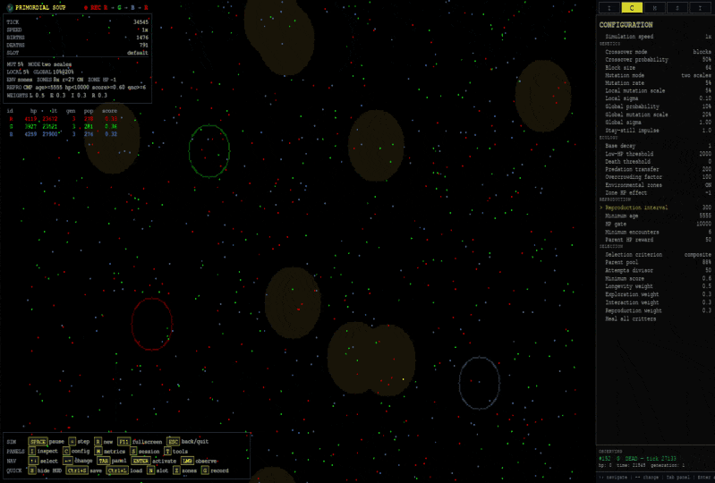

# 🧬 Primordial Soup

<p align="center">
  
</p>

<p align="center">
  
  
  
  
</p>



**An artificial-life aquarium where tiny neural critters see, move, interact, reproduce, mutate, and occasionally make terrible evolutionary decisions.**

You do not control them.

You build the universe, define its rules, press **SPACE**, and watch what happens.

Sometimes evolution looks clever.

Sometimes an entire lineage walks into a hazardous zone.

Science is like that.

---

## What is Primordial Soup?

**Primordial Soup** is an artificial-life simulation populated by autonomous critters with small neural networks.

Each critter can:

* perceive the local world around it;
* process that information through its own neural network;
* decide where to move;
* interact with allies and enemies;
* gain or lose HP;
* explore the environment;
* reproduce when eligible;
* pass its genome to descendants;
* accumulate mutations across generations;
* and, eventually, die.

There is no player-controlled creature and no predefined winning strategy.

The interesting part is watching behavior emerge from simple rules, inheritance, environmental pressure, and lots of numerical linear algebra.

> 🧠 The critters do not learn through backpropagation. Their neural networks are inherited. Evolution does the optimization — slowly, noisily, and without reading the documentation.

---

## The universe in 20 seconds

Every simulation tick roughly follows this cycle:

```text
        perceive
           ↓
          think
           ↓
          move
           ↓
        interact
           ↓
    gain / lose HP
           ↓
      survive / die
           ↓
       reproduce
      when eligible
           ↓
        inherit
           ↓
         mutate
```

The world is **toroidal**.

Walk through the right edge and you return on the left. Leave through the bottom and you reappear at the top.

There are no walls.

Pac-Man would understand immediately.

Three lineages — **R**, **G**, and **B** — coexist in a non-transitive ecological cycle. No lineage has a permanent universal advantage over the other two.

Add environmental zones, mutation, selection pressure and finite populations, and the result becomes surprisingly difficult to predict.

Which is precisely the point.

---

## 🐣 Run it

### Python

```bash
pip install .
python -m primordial_soup
```

GIF recording is optional:

```bash
pip install .[recording]
```

### Nix

```bash
nix develop .
nix run .
```

The simulation starts **paused**.

Press:

```text
SPACE
```

Life begins.

No paperwork required.

---

## 🎮 Essential controls

You can learn almost everything else later.

| Key             | Action                                  |
| --------------- | --------------------------------------- |
| **SPACE**       | Pause / resume                          |
| **= / +**       | Advance exactly one tick                |
| **R**           | Create a completely new run             |
| **I**           | Open / close inspection mode            |
| **Mouse click** | Observe a critter                       |
| **← / →**       | Change the discovery criterion          |
| **Tab**         | Change the discovery lineage filter     |
| **Enter**       | Observe the current discovery candidate |
| **M**           | Change the chart metric                 |
| **S / L**       | Save / load                             |
| **N**           | Change save slot                        |
| **Z**           | Enable / disable environmental zones    |
| **G**           | Start / stop GIF recording              |
| **F11**         | Fullscreen                              |
| **ESC**         | Leave the universe                      |

Some ecological parameters can also be adjusted while the simulation is running.

See [Controls](docs/controls.md) for the complete reference.

---

## 🔍 Watch a critter

Press **I** to open the inspection panel.

This is where Primordial Soup stops looking like colored noise and starts becoming biology with debugging tools.

The inspection system distinguishes two ideas:

### Discovery

Discovery answers:

> **Who looks interesting right now?**

You can change:

* the selection criterion with **← / →**;
* the lineage filter with **Tab**.

The simulation then identifies a candidate matching that lens.

Changing the discovery lens does **not** silently replace the critter you are already observing.

That distinction is deliberate.

### Observation

Observation answers:

> **Who am I actually following?**

You explicitly choose an observed critter by:

* opening inspection mode;
* clicking one directly;
* or pressing **Enter** to adopt the current discovery candidate.

Think of it this way:

```text
DISCOVERY                          OBSERVATION

criterion: oldest                 critter #1847
lineage: G                        lineage: R
candidate: #903                   status: alive
      │
      │ ENTER
      ▼
observe #903
```

Changing your search criteria does not magically teleport the microscope.

If the observed critter dies, observation does not automatically jump to another individual. Its final state is preserved so you can inspect what happened.

Death ends the critter.

It does not end the autopsy.

See [Inspection](docs/inspection.md) for the full system.

---

## 🧠 Tiny brains, large consequences

Each critter carries its own neural-network genome.

Its inputs include information about:

* nearby lineage densities;
* its own internal state;
* its recent neural state.

Its outputs represent possible movements in the local neighborhood.

The network also carries a lightweight recurrent state, giving the critter a small amount of short-term memory.

There is no central controller telling individuals what to do.

Two genetically different critters standing in the same place may make completely different decisions.

And because their networks are inherited, successful behavior can propagate across generations even though nobody explicitly programmed that behavior.

For the implementation details, see [Architecture](docs/architecture.md).

---

## 🧬 Evolution

Reproduction is not simply:

```text
alive → have children
```

That would make evolutionary biology suspiciously easy.

Individuals must satisfy reproductive conditions before they can become candidate parents. Selection can take survival, exploration, interaction and reproductive success into account.

Eligible parents contribute genomes to offspring through crossover, followed by mutation.

Over many generations this creates a feedback loop:

```text
behavior
   ↓
ecological outcome
   ↓
selection
   ↓
reproduction
   ↓
inheritance
   ↓
mutation
   ↓
new behavior
```

There is no guarantee that evolution finds a globally optimal solution.

Populations can converge.

They can specialize.

They can oscillate.

They can get stuck.

They can also go extinct with impressive efficiency.

See [Evolution](docs/evolution.md) for the actual reproductive and genetic model.

---

## 🌍 Ecology

The world contains three interacting lineages:

```text
R
G
B
```

Their relationships form a non-transitive cycle: ecological advantage depends on who else is present.

This prevents the simulation from reducing immediately to a simple “strongest lineage wins” system.

Population density also matters.

So do:

* HP;
* encounters;
* environmental zones;
* reproduction constraints;
* mutation;
* spatial distribution;
* and plain old bad luck.

Environmental zones can be beneficial, neutral or harmful depending on their current HP effect.

A refuge can become a trap while the simulation is running.

Evolution receives no advance notice.

---

## 📈 What should I watch?

Do not look only at population size.

Interesting signals include:

* population by lineage;
* average HP;
* longest lifetime;
* maximum generation;
* average composite score;
* mutation behavior;
* extinction events;
* spatial clustering;
* lineage dominance;
* repeated movement patterns;
* and changes in the individuals selected by different inspection criteria.

A population surviving for a long time does not necessarily mean it is evolving in an interesting way.

Likewise, chaos is not automatically adaptation.

The charts tell part of the story.

Inspection tells another.

Repeated experiments tell much more.

---

## 🧪 Try breaking evolution scientifically

A few good starting experiments:

### Low mutation

Reduce mutation and run for many generations.

Question:

> Does the population stabilize around a small set of strategies?

### High mutation

Increase mutation aggressively.

Question:

> Does diversity improve adaptation, or does inheritance become too noisy to preserve useful behavior?

### Environmental traps

Make environmental zones harmful.

Question:

> Can populations evolve behavior that reduces exposure to dangerous regions?

### Long runs

Run tens of thousands of ticks.

Question:

> Do lifetime, generation depth and composite score continue improving, or does the system reach a plateau?

### Same seed, different rule

Run two headless experiments from the same seed while changing exactly one parameter.

Question:

> Was the difference caused by the parameter or by random history?

More structured experiments live in [Experiments](docs/experiments.md).

Lab coat optional.

Fixed random seed recommended.

---

## 🤖 Headless experiments

Primordial Soup can run without opening the graphical interface.

That is useful for:

* long experiments;
* reproducible runs;
* parameter sweeps;
* automated tests;
* CI;
* collecting savegames for later inspection.

Example:

```bash
python -m primordial_soup --new -d 10000 -s world_a --seed 42
```

Continue an existing run:

```bash
python -m primordial_soup -l world_a -d 5000
```

Long run without per-tick noise:

```bash
python -m primordial_soup --new -d 100000 -s world_a --seed 42 -q
```

A save produced headlessly can be opened later in the graphical simulation.

See [Headless experiments](docs/headless.md).

---

## 💾 Save, kill the universe, restore it

The simulation provides multiple save slots.

This makes comparative experiments much easier:

```text
run A → save world_a
run B → save world_b
run C → save world_c
```

Then load each world and inspect the resulting population.

Savegames are versioned because genomes, neural architectures and simulation state evolve together with the project.

When the format changes incompatibly, Primordial Soup prefers rejecting an invalid world over quietly resurrecting it incorrectly.

Even artificial life deserves data integrity.

See [Persistence](docs/persistence.md).

---

## 🧪 Primordial Soup is an experiment, not a biological model

The simulation borrows ideas from:

* artificial life;
* evolutionary algorithms;
* neural networks;
* ecology;
* inheritance;
* mutation;
* selection;
* spatial interaction.

But it is intentionally simplified.

A critter is not an organism.

HP is not metabolism.

A neural matrix is not a biological brain.

A few thousand generations in NumPy do not settle evolutionary biology.

The value of the project lies elsewhere: it provides a compact environment where complex population-level behavior can emerge from explicit rules that are easy to inspect, modify and experiment with.

That makes it useful as both a programming project and a playground for thinking about adaptive systems.

---

## 📚 Documentation

The README gives you the map.

The documents below contain the territory.

| Document                                   | What it answers                                                 |
| ------------------------------------------ | --------------------------------------------------------------- |
| [Getting started](docs/getting-started.md) | How do I start without reading a textbook?                      |
| [Simulation](docs/simulation.md)           | What exactly is this universe and how does it work?             |
| [Controls](docs/controls.md)               | What does every key and runtime control do?                     |
| [Inspection](docs/inspection.md)           | How do discovery, observation, trails and death snapshots work? |
| [Evolution](docs/evolution.md)             | How do selection, reproduction, crossover and mutation work?    |
| [Experiments](docs/experiments.md)         | What interesting experiments can I run?                         |
| [Headless](docs/headless.md)               | How do I run reproducible batch simulations?                    |
| [Configuration](docs/configuration.md)     | Which laws of the universe can I change?                        |
| [Architecture](docs/architecture.md)       | How is the simulation implemented?                              |
| [Persistence](docs/persistence.md)         | What is saved, restored and versioned?                          |

A useful rule of thumb:

```text
README         → Why should I care?
Getting started → How do I run it?
Simulation      → What is happening?
Evolution       → Why does it change?
Experiments     → What should I test?
Architecture    → How is it implemented?
```

---

## 🛠️ Want to modify the universe?

Start with:

```text
docs/architecture.md
docs/configuration.md
```

The codebase separates the laws of the simulation from the machinery that executes them.

If you want to change the physics, ecology, cognition or inheritance model, understand that distinction first.

Otherwise you may accidentally discover a new law of nature called:

```text
regression
```

---

## In one sentence

**Primordial Soup is an artificial-life simulation where populations of tiny inherited neural networks perceive a toroidal world, interact, survive, reproduce and mutate while you observe the evolutionary consequences.**

Now go poke the soup.

🥣🧬

---

## 📜 License

Primordial Soup is licensed under the **MIT License**.

See [LICENSE](LICENSE).
